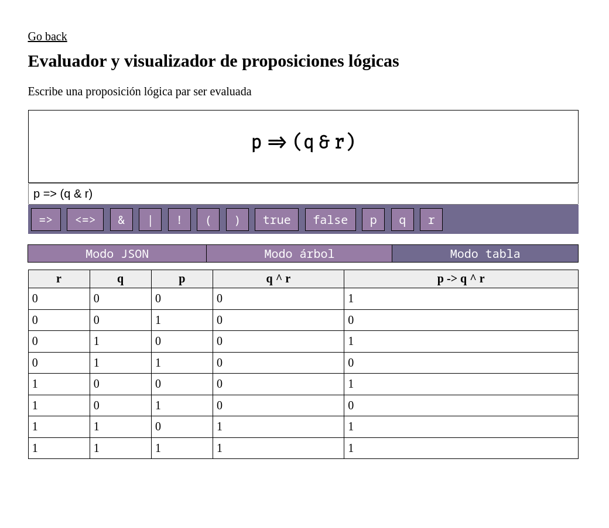

# Boolean Algebra and Logical expressions

NOTA: Mi portafolio de clase con todos mis proyectos (includo este) estará siempre desplegado en
<https://paoloose.site/discmaths/>

Todos los proyectos serán interactivos :)

El código cuenta con dos módulos:

- `logic-parser` contiene los algoritmos de análisis léxico, sintático, y renderizado de árboles en SVG escritos en 100% Rust.

- `logic-parser-wasm` contiene solo bindings de Rust
a WebAssembly para poder desplegar el proyecto en la web!

## Problema

La enseñanza de la lógica proposicional carece de herramientas didácticas e interactivas
que permitan aportar al estudiante una mejor comprensión de la lógica abstracta, su utilidad y
aplicación en la ciencia de la computación.

### Objetivo general

Desarrollar una aplicación interactiva para docentes y alumnos que permita
visualizar expresiones lógicas y cómo estas pueden evaluarse en tablas de verdades y árboles de
sintaxis.

### Objetivos específicos

1. Que los estudiantes de Ingeniería de Software se interesen por las estructuras de datos
   involucradas en el análisis léxico y sintáctico de expresiones lógicas.

2. Captar el interés de los estudiantes por los algoritmos involucrados en la lógica para así
   poderlos introducir a problemas más complejos de la lógica como el problema de la
   satisfacibilidad o los mapas de Karnaugh.

3. Presentar un proyecto documentado, accesible, y de código abierto a la disponibilidad de los
   estudiantes de Ingeniería de Software para que puedan nutrirse de él y mejorar sus
   capacidades de programación.

Ver en  vivo en <https://paoloose.site/discmaths/assignments/week1/> !

