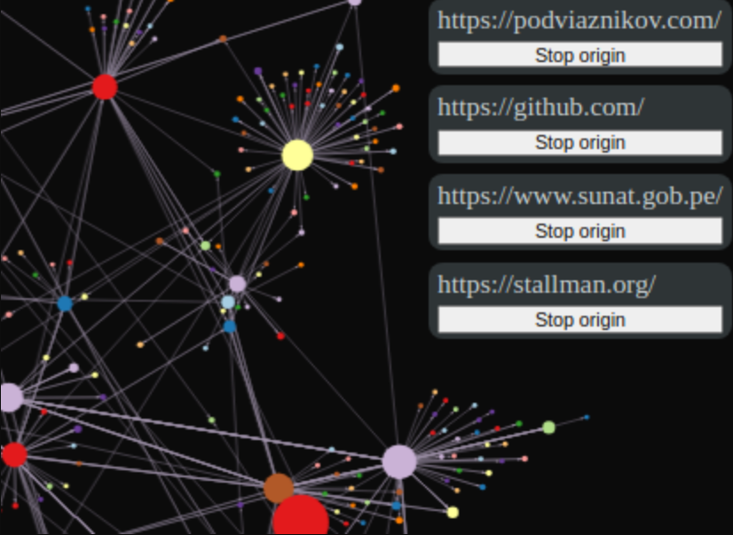
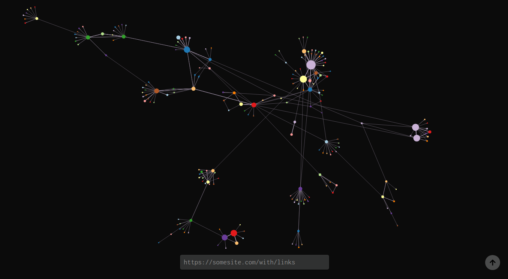
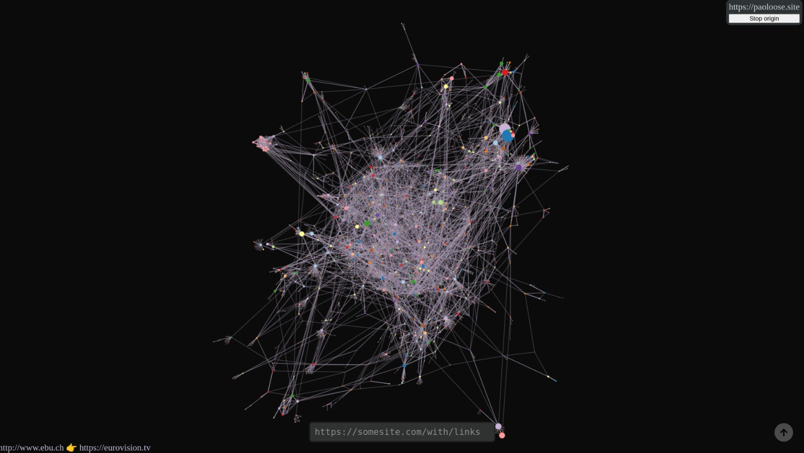
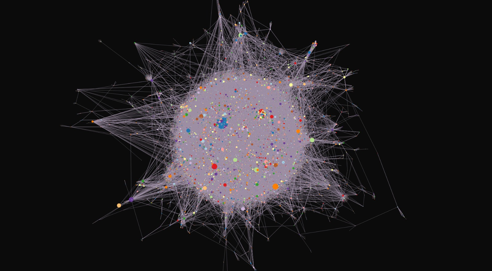

    <h2 align="center">Interlinker</h2>
    
A real-time web visualizer based on crawling and graph theory

    

    
    

Running live at <https://www.paoloose.site/discmaths/project/3/>

Part of the [series of Discrete Mathematics projects](https://paoloose.site/discmaths).

What if you can see how the web is created?

It's impossible to map the entire internet, but what if we can generate an small portion of it?

## How it works?

The concept behind Interlinker is really simple:

- You seed the crawler with a url ('the origin')
- It will start crawling that page, looking for links (`<a/>` tags)
- The links found will be added to a queue
- It will repeat the process for each link in the queue

You can feed multiple origins to the crawler, and it will crawl them in parallel!

## Gallery

The Interlinker's graph seeded with <https://paoloose.site> after:

3 minutes of crawling:

20 minutes of crawling:

3 hours of crawling:

## Acknowledgements

- Graph visualization: <https://github.com/vasturiano/force-graph>
- WebSocket implementation: <https://github.com/seanmonstar/warp>
